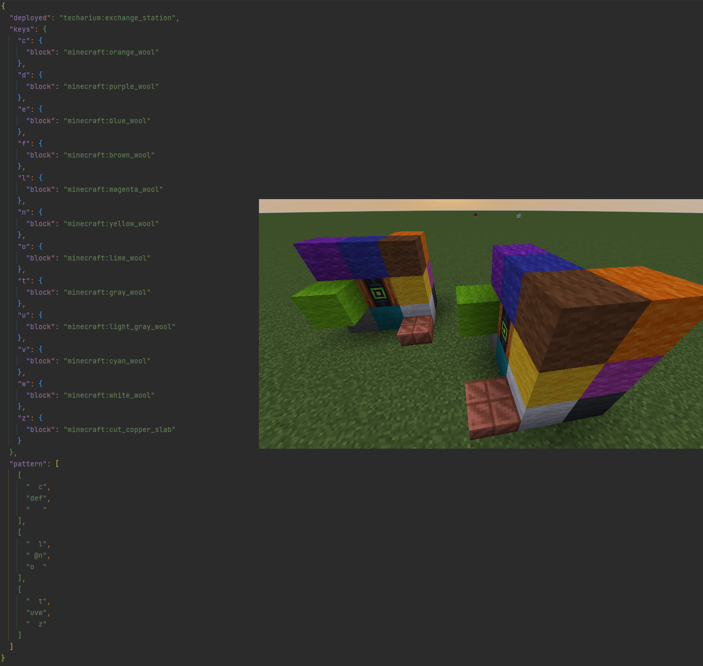

# Multiblock Datapack

Multiblocks can be added, modified or removed via datapack.  
They are placed in `data/<your_namespace>/techarium/multiblock/` (default techarium multiblocks are
in `data/techarium/techarium/multiblock`).

## JSON Format

```json5
{
  "deployed": "techarium:exchange_station",  // the deploying block to transform to
  "keys": {
    // the keys used in the pattern
    "a": {
      // determine the block of this key, it can be :
      //  - a resource location of a block
      //  - a resource location of a tag
      //  - a list of resource location of blocks and/or tags
      "block": "minecraft:stone_slab",
      // optional value to determine the states the block needs to match
      "states": [
        "type=bottom",  // same property with different values : one of them need to match
        "type=top"
        // waterlogged state not added : can be any value
      ],
      // optional value to determine the nbt tag the block needs to match
      "nbtTag": {
      }
    }
  },
  "pattern": [
    // pattern of the multiblock layer by layer
    // there can be as many layer as you want
    // each layer must have the same amount of string and each string the same amount of character
    // the char '@' must be present in one string and is reserved for the multiblock core block
    [
      // layer 1 : top of the multiblock
      "   ",
      "   ",
      "   "
    ],
    [
      // layer 2 : middle of the multiblock
      " b ",  // b : behind the core
      "l@r",  // l : left side of the core, r : right side of the core
      " f "   // f : front of the core
    ],
    [
      // layer 3 : bottom of the multiblock
      "   ",
      "   ",
      "   "
    ]
  ]
}
```

Here is an exemple of a multiblock with its in-game representation

